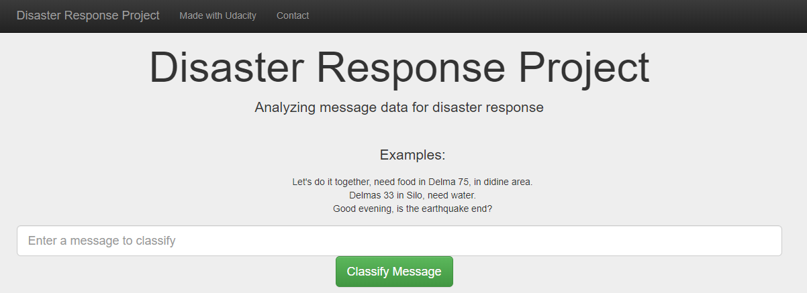
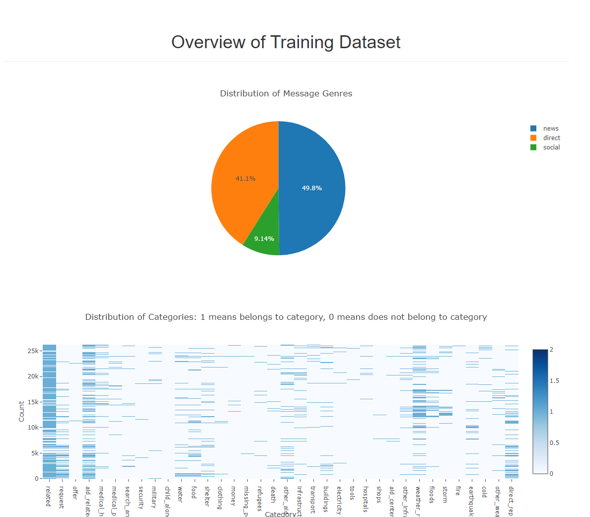

# Disaster Response Pipeline Project

## A. Instructions:

1. Prerequisites

    Install the packages with
    ```pip install -r requirements.txt```

2. Run the following commands in the project's root directory to set up the database and model.

    - To run ETL pipeline that cleans data and stores in database
        `python data/process_data.py data/disaster_messages.csv data/disaster_categories.csv data/DisasterResponse.db`
    - To run ML pipeline that trains classifier and saves
        `python models/train_classifier.py data/DisasterResponse.db models/classifier.pkl`

3. Run the following command in the app's directory to run the web app.
    `python run.py`

4. Go to http://0.0.0.0:3001/ or http://localhost:3001/

## B. Overview

### 1. ETL: process_data.py
The first part of the data pipeline is the Extract, Transform, and Load process. Here, the dataset will be read, cleaned, and then stored in a SQLite database.


### 2. Machine Learning Pipeline: train_classifier.py
The data will be split into a training set and a test set. Then, a machine learning pipeline will be created that uses NLTK, as well as scikit-learn's Pipeline and GridSearchCV to output a final model that uses the message column to predict classifications for 36 categories (multi-output classification). Finally, the model will be exported to a pickle file.

### 3. Flask App
In the last step, the results will be displayed in a Flask web app.

## C. Preview of Web App



